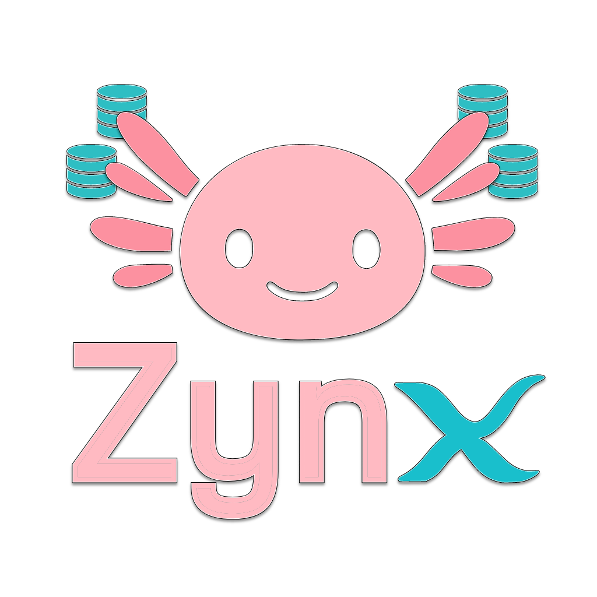

# 

> The Axolotl-Powered DBML Migration System for Deno


**Zynx** is a powerful, Deno-native migration system that transforms your DBML schema definitions into seamless database migrations. Just like how axolotls regenerate their limbs perfectly, Zynx regenerates your database schema with precision and grace.

## ✨ Features

- **🔄 Regenerative Migrations**: Automatic snapshot and incremental migration generation
- **🌊 Smooth Evolution**: Seamless schema changes with intelligent diffing
- **🧬 Flexible Configuration**: Adaptable to any project structure
- **🦎 Developer Friendly**: Intuitive CLI with helpful axolotl-themed messages
- **🎯 PostgreSQL Optimized**: Built specifically for PostgreSQL (with extensibility)
- **🚀 Deno Native**: First-class TypeScript support with modern APIs

## 🏊‍♀️ Quick Start

### Installation

```bash
# Use directly from Deno registry
deno run --allow-all https://deno.land/x/zynx@v1.0.0/cli.ts --help

# Or add to your project
echo '{"imports": {"zynx": "https://deno.land/x/zynx@v1.0.0/mod.ts"}}' > deno.json
```

### Basic Usage

```typescript
import { ZynxManager, createConfig } from "zynx";

const zynx = new ZynxManager(createConfig({
  dbmlPath: "./database.dbml",
  migrationsDir: "./migrations",
  database: {
    type: "postgresql",
    connectionString: "postgresql://localhost:5432/myapp"
  }
}));

// Generate migrations from DBML
await zynx.generate();

// Apply migrations to database
await zynx.run();

// Check migration status
const status = await zynx.status();
console.table(status.migrations);
```

### CLI Commands

```bash
# Generate migrations from DBML changes
zynx generate

# Apply pending migrations
zynx run

# Show migration status
zynx status

# Initialize new project with Zynx
zynx init
```

## 🧬 How It Works

Zynx follows the regenerative philosophy of its axolotl mascot:

1. **🔍 Schema Analysis**: Compares your current `database.dbml` with the last snapshot
2. **🧬 Change Detection**: Intelligently detects additions, modifications, and deletions
3. **🌊 Migration Generation**: Creates clean SQL migrations for incremental changes
4. **🦎 Regeneration**: Updates the complete snapshot for fresh database creation
5. **✨ Healing**: Applies migrations safely with transaction-based execution

## 🎯 Configuration

Create a `zynx.config.ts` file in your project root:

```typescript
import { ZynxConfig } from "zynx";

export default {
  dbmlPath: "./database.dbml",
  migrationsDir: "./migrations",
  database: {
    type: "postgresql",
    connectionString: Deno.env.get("DATABASE_URL")!,
    ssl: true
  },
  settings: {
    migrationTableName: "_migrations",
    snapshotName: "snapshot",
    migrationPrefix: "app_",
    transactionMode: "single"
  },
  hooks: {
    beforeGenerate: async () => console.log("🦎 Zynx is analyzing your schema..."),
    afterRun: async (result) => console.log(`✨ Applied ${result.count} migrations!`)
  }
} satisfies ZynxConfig;
```

## 📖 Documentation

- [Getting Started Guide](./docs/getting-started.md)
- [Configuration Reference](./docs/configuration.md)
- [Migration Best Practices](./docs/best-practices.md)
- [API Documentation](./docs/api.md)
- [Troubleshooting](./docs/troubleshooting.md)

## 🌟 Examples

Check out the [examples directory](./examples) for:

- [Basic Usage](./examples/basic) - Simple single-table project
- [Advanced Setup](./examples/advanced) - Complex multi-table schema with relationships
- [Existing Project](./examples/migration) - Migrating from other migration systems

## 🤝 Contributing

We welcome contributions! Please see our [Contributing Guide](./CONTRIBUTING.md) for details.

## 📄 License

MIT License - see [LICENSE](./LICENSE) for details.

## 🦎 About the Axolotl

The axolotl is famous for its incredible regenerative abilities - it can regrow entire limbs, organs, and even parts of its brain with perfect precision. This makes it the perfect mascot for a migration system that regenerates database schemas seamlessly and reliably.

---

**Made with 💙 by the Zynx team**